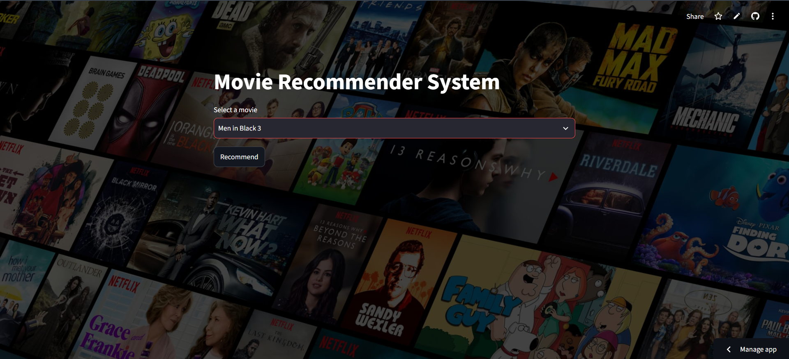

# 🎬 Movie Recommender System

<div align="center">


### 🚀 A Content-Based Movie Recommendation System built with Python, Machine Learning, and Streamlit.

🔗 **Live Demo:** [Movie Recommender System](https://movie-recommender-system-lfnxtqhtdfi6flibjpwfh6.streamlit.app/)

</div>

---

## 📌 Overview

The **Movie Recommender System** is a Machine Learning web application that recommends movies based on content similarity. Users can select a movie from the dropdown menu, and the application suggests five similar movies along with their posters fetched from the **TMDB API**.

This project demonstrates the practical implementation of **Content-Based Filtering**, **Natural Language Processing (NLP)** techniques, and **Machine Learning** in a user-friendly web interface.

---

## ✨ Features

- 🎥 Recommend similar movies instantly
- 🖼️ Fetch movie posters using the TMDB API
- 🎯 Content-Based Recommendation System
- ⚡ Interactive Streamlit UI
- 📱 Responsive and clean interface
- 🌐 Deployed on Streamlit Community Cloud

---

## 🛠️ Tech Stack

| Category             | Technologies              |
| -------------------- | ------------------------- |
| Programming Language | Python                    |
| Frontend             | Streamlit                 |
| Data Processing      | Pandas, NumPy             |
| Machine Learning     | Scikit-learn              |
| API                  | TMDB API                  |
| Version Control      | Git & GitHub              |
| Deployment           | Streamlit Community Cloud |

---

## 📂 Project Structure

```text
Movie-Recommender-System/
│── app.py
│── requirements.txt
│── movies.pkl
│── movie_dict.pkl
│── similarity.pkl
│── image.png
│── movie_recommender_system.ipynb
│── .gitignore
└── README.md
```

---

## ⚙️ Installation

### Clone the repository

```bash
git clone https://github.com/Shubham-99971/Movie-Recommender-System.git
```

### Navigate to the project

```bash
cd Movie-Recommender-System
```

### Install dependencies

```bash
pip install -r requirements.txt
```

### Run the application

```bash
streamlit run app.py
```

---

## 🧠 How It Works

1. User selects a movie.
2. The application searches for the selected movie in the dataset.
3. A precomputed similarity matrix is used to identify the most similar movies.
4. Movie posters are fetched from the TMDB API.
5. Five recommended movies are displayed with their posters.

---

## 📸 Application Preview

### Home Page



### Recommendations


---

## 📈 Future Improvements

- ⭐ Movie ratings
- 🎬 Movie trailers
- 📖 Movie overview
- 🎭 Genre filtering
- 🔍 Search suggestions
- ❤️ Favorite movies
- 📱 Mobile-friendly UI

---

## 🤝 Contributing

Contributions are welcome!

1. Fork the repository
2. Create a new branch

```bash
git checkout -b feature-name
```

3. Commit your changes

```bash
git commit -m "Add new feature"
```

4. Push to GitHub

```bash
git push origin feature-name
```

5. Open a Pull Request

---

## 👨‍💻 Author

**Shubham**

- GitHub: [Shubham-99971](https://github.com/Shubham-99971)
- LinkedIn: [Shubham Bhatt](https://www.linkedin.com/in/shubham-bhatt-s0816)

---

## ⭐ Support

If you found this project helpful, please consider giving it a ⭐ on GitHub!

---

<div align="center">

### 🎬 Happy Movie Watching! 🍿

Made with ❤️ using Python & Streamlit

</div>
